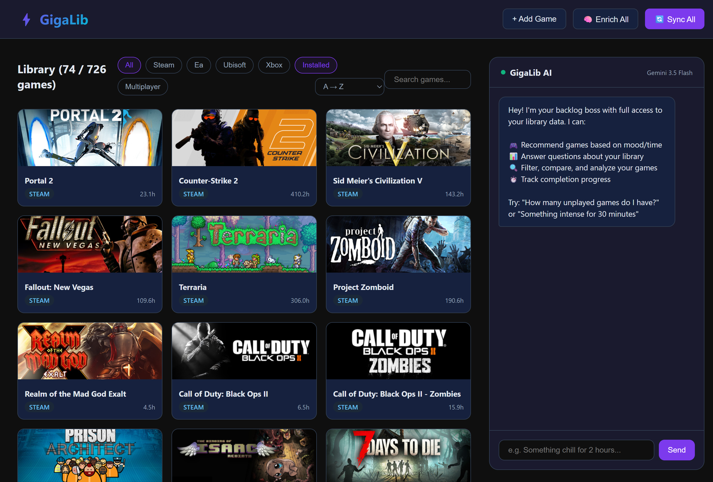

# GigaLib

<p align="center">
  
</p>

A self-hosted Python web app that aggregates your game libraries from **Steam**, **EA Desktop**, **Ubisoft Connect**, and **Xbox/Game Pass** into a single unified dashboard — with AI-powered recommendations, IGDB ratings, and HowLongToBeat completion times.

GigaLib can also connect to the lightweight standalone Social API so you can add friends, compare shared games, see who is online, and send messages without sharing your whole local database.



## Features

- **Multi-platform sync** — Automatically detects installed games from Steam, EA Desktop (including encrypted IS file decryption), Ubisoft Connect, and Xbox/Game Pass
- **Game enrichment** — Fetches critic ratings, genres, descriptions, cover art (IGDB), and completion times (HowLongToBeat)
- **AI Assistant** — Chat with Gemini about your backlog: get recommendations by mood, time available, or genre; ask library stats; compare games
- **Conversation history** — Saves chats to the local SQLite database so you can browse previous convos later
- **Social API integration** — Create a handle, add friends, sync a privacy-filtered library snapshot, compare shared games, see online friends, and send friend messages
- **Launch games** — Start any game directly from the dashboard via platform-native URLs (steam://, origin2://, uplay://)
- **Production-ready** — Runs as a waitress WSGI server or Windows service

## Quick Start

### Prerequisites

- **Python 3.11+**
- **[uv](https://docs.astral.sh/uv/)** — Fast Python package manager
- **Windows** — Required for local game detection (registry, file system scanning)

### 1. Clone and install

```powershell
git clone <your-repo-url> Gigalib
cd Gigalib
uv sync
```

### 2. Configure environment

Copy the example env file and fill in your API keys:

```powershell
Copy-Item .env.example .env
```

Edit `.env` with your keys:

| Variable | Where to get it |
|----------|----------------|
| `SECRET_KEY` | Any random string (e.g. `python -c "import secrets; print(secrets.token_hex(32))"`) |
| `STEAM_API_KEY` | [Steam Web API](https://steamcommunity.com/dev/apikey) |
| `STEAM_USER_ID` | Your Steam64 ID (find at [steamid.io](https://steamid.io)) |
| `XBOX_API_KEY` | [OpenXBL](https://xbl.io) — free tier works |
| `GEMINI_API_KEY` | [Google AI Studio](https://aistudio.google.com/apikey) |
| `TWITCH_CLIENT_ID` | [Twitch Dev Console](https://dev.twitch.tv/console) (for IGDB) |
| `TWITCH_CLIENT_SECRET` | Same Twitch app as above |
| `GIGALIB_SOCIAL_URL` | Social API URL. Default public test service: `http://api.gigalib.uk:8081` |
| `SOCIAL_SECRET_KEY` | Secret key for running your own standalone Social API |
| `SOCIAL_DATABASE_URL` | SQLAlchemy URL for the Social API database, for example `sqlite:///gigalib-social.db` |
| `SOCIAL_HOST` | Bind host for `scripts/serve_social.py`, for example `127.0.0.1` or `0.0.0.0` |
| `SOCIAL_PORT` | Bind port for `scripts/serve_social.py`, defaults to `8081` |

### 3. Configure platform paths

Edit `platforms.yaml` to match your install locations:

```yaml
steam:
  paths:
    - "C:\\Program Files (x86)\\Steam"
    - "D:\\SteamLibrary"  # Additional Steam libraries

ea:
  install_data:
    - "C:\\ProgramData\\EA Desktop\\InstallData"
  games_dirs:
    - "C:\\Program Files\\EA Games"

ubisoft:
  config_cache:
    - "C:\\Program Files (x86)\\Ubisoft\\Ubisoft Game Launcher\\cache\\configuration\\configurations"
  games_dirs:
    - "C:\\Program Files (x86)\\Ubisoft\\Ubisoft Game Launcher\\games"
```

### 4. Run

**Development:**

```powershell
uv run python scripts/run.py
```

Open http://127.0.0.1:5000

**Production:**

```powershell
uv run python scripts/serve.py --host 0.0.0.0 --port 8080
```

## Usage

1. **Sync** — Click the sync button to scan all platforms and detect your games
2. **Enrich** — Click enrich to fetch ratings, genres, and completion times from IGDB/HLTB
3. **Browse** — Filter by platform, genre, rating, or installed status
4. **Ask the AI** — Use the assistant chat to get personalized recommendations
5. **Use Social** — Sign in with a handle, sync your privacy-filtered snapshot, add friends, filter by shared libraries, use party mode, see online friends, and send messages
6. **Review history** — Open the History page to revisit past assistant conversations

## Social API

The local GigaLib app talks to a separate lightweight Flask service for account handles, friend requests, library snapshots, online presence, and messages. The local app keeps your full game database private; only the privacy-filtered snapshot you sync is sent to the service.

The current public service URL is:

```text
http://api.gigalib.uk:8081
```

Set `GIGALIB_SOCIAL_URL` in `.env` to use that service or your own hosted Social API. The UI also lets you override the service URL from the Sign In modal.

### Social Usage

1. Open GigaLib and click **Sign In** in the top-right corner.
2. Create an account with a handle and password, or sign in to an existing handle.
3. Click **Sync Social** from the Social page to upload a privacy-filtered snapshot.
4. Search for friends by handle and send friend requests.
5. Use the library side widget to filter games by one friend or by a party of multiple friends.
6. Keep the browser open to check in automatically, which shows your friends whether you are online.
7. Use **Chat** next to **AI** and **Social** in the side widget, or the Social page, to send friend messages.

### Run Your Own Social API

```powershell
uv run python scripts/serve_social.py --host 127.0.0.1 --port 8081
```

Health check:

```powershell
Invoke-RestMethod http://127.0.0.1:8081/health
```

For a small Linux host, run the service with `SOCIAL_HOST=0.0.0.0`, put a reverse proxy in front of it for TLS, and point local clients at that URL with `GIGALIB_SOCIAL_URL`.

### Social API Endpoints

- `GET /health`
- `POST /v1/auth/register`
- `POST /v1/auth/login`
- `POST /v1/auth/logout`
- `GET /v1/me`
- `POST /v1/presence` or `POST /v1/presence/check-in`
- `GET /v1/users/search?q=<handle>`
- `PUT /v1/library/snapshot`
- `GET /v1/friends`
- `GET /v1/friends/<friend_id>/library`
- `GET /v1/friend-requests`
- `POST /v1/friend-requests`
- `POST /v1/friend-requests/<request_id>/accept`
- `POST /v1/friend-requests/<request_id>/decline`
- `GET /v1/messages?friend_id=<friend_id>`
- `POST /v1/messages`
- `POST /v1/compare`

## Project Structure

```
Gigalib/
├── platforms.yaml      # Platform path configuration
├── pyproject.toml      # Dependencies and project metadata
├── .env                # API keys (not committed)
├── gigalib/            # The package
│   ├── __init__.py     # Package init, create_app factory
│   ├── app.py          # Flask app configuration
│   ├── routes.py       # All HTTP routes
│   ├── models.py       # SQLAlchemy Game model
│   ├── platforms.py    # Platform detection (Steam/EA/Ubisoft/Xbox)
│   ├── enricher.py     # IGDB + HowLongToBeat enrichment
│   ├── assistant.py    # Gemini AI chat integration
│   └── templates/      # Jinja2 HTML templates
├── gigalib_social_service/ # Standalone Social API package
├── scripts/
│   ├── run.py          # Dev server (Flask debug mode)
│   ├── serve.py        # Production server (waitress)
│   ├── serve_social.py # Standalone Social API server
│   ├── enrich.py       # CLI enrichment tool
│   ├── setup.ps1       # Interactive setup wizard
│   └── install_service.py  # Windows Task Scheduler service installer
└── instance/
    └── gigalib.db      # SQLite database (auto-created)
```

## API Keys Guide

### Steam
1. Go to https://steamcommunity.com/dev/apikey
2. Register a domain (can be `localhost`)
3. Copy the key

### Xbox (OpenXBL)
1. Create free account at https://xbl.io
2. Go to Settings → API Keys
3. Copy your key

### IGDB (via Twitch)
1. Create a Twitch account and go to https://dev.twitch.tv/console
2. Register a new application (any name, category: Website Integration, OAuth redirect: `http://localhost`)
3. Copy the Client ID and generate a Client Secret

### Gemini (for AI Assistant)
1. Go to https://aistudio.google.com/apikey
2. Create an API key
3. Free tier has rate limits (~15 requests/minute)

## Troubleshooting

- **"No games found after sync"** — Check `platforms.yaml` paths match your actual install directories
- **"Enrichment returning 0"** — Verify your Twitch Client ID/Secret are correct (used for IGDB)
- **"Assistant says rate limited"** — Gemini free tier caps at ~15 req/min; wait a moment and retry
- **Conversation history missing** — Past chats are stored in `instance/gigalib.db`; open the History page from the top bar
- **EA games missing** — EA Desktop must be installed; the app decrypts the IS file for the full library
